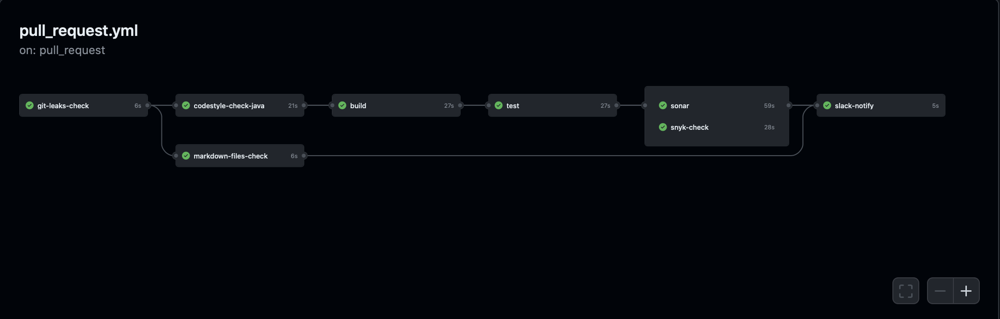

# Travelly Project

## DevOps

### Pull request workflow (pull_request.yml)

This workflow is run on every pr raised in the repository.
It looks like this: 

It consists of 8 stages as follows:

**Git Leaks Check**

- **Technology Used:** Gitleaks
- **Purpose:** Scans the codebase for sensitive information and
potential security risks, preventing unintentional exposure of sensitive data.

**Secrets Scanning**

- **Technology Used:** truffleHog
- **Purpose:** Identifies high-entropy strings indicative of secrets or
credentials, ensuring that no sensitive information is inadvertently committed.

**Markdown Files Check**

- **Technology Used:** Custom Script
- **Purpose:** Verifies the structure and content of Markdown files,
ensuring consistent documentation practices.

**Build**

- **Technology Used:** Maven (Java)
- **Purpose:** Compiles and builds the project, ensuring that
the code can be successfully translated into an executable form.

**Unit Testing**

- **Technology Used:** JUnit (Java)
- **Purpose:** Executes unit tests to validate that individual units
of code perform as expected, catching errors early in the development process.

**Static Code Analysis**

- **Technology Used:** SonarQube
- **Purpose:** Analyzes the source code for bugs, vulnerabilities,
and code smells, ensuring code quality and security standards are met.

**Dependency Scanning**

- **Technology Used:** Snyk
- **Purpose:** Checks for known vulnerabilities in project dependencies,
helping to keep third-party libraries secure.

**Slack announcement**

- **Technology Used:** Slack
- **Purpose:** Notifies all the stakeholders about
the current stated of the PR in a dedicated channel in Slack.

These stages collectively ensure that each pull request is
thoroughly examined for security, code quality, and functionality,
contributing to a robust and reliable codebase.

### Jira Transition On Pull Request (jira_transition_on_pr.yml)

This workflow is taking the ticket id in Jira from the PR title
and moves the status of the issue as follows In Progress -> In Review.

### Jira Transition On Merge (jira_transition_on_merge.yml)

This workflow is taking the ticket id in Jira from the PR title
and moves the status of the issue as follows In Review -> Done.

### Build and Push Docker Image (build_and_push.yml)

This workflow is manually triggered.
It is building a docker image using the Dockerfile on the root level
and then uploads the image to GitHub Docker Registry
on the following address:
ghcr.io/${{ github.repository_owner }}/${{ github.repo_name }}:${{ github.sha }}

### Build and Push Docker Image on Release (build_and_push_on_release.yml)

This workflow is triggered when a new release is made on the main branch.
It is building a docker image using the Dockerfile on the root level
and then uploads the image to GitHub Docker Registry
on the following address:
ghcr.io/${{ github.repository_owner }}/${{ github.repo_name }}:${{ release.tag}}

## _The Best Travel App, Ever..._

Welcome to the Travelly project!
This repository contains a Java Spring Maven project
for a travel management application.

## [Link to frontend](https://github.com/panayot-marinov/travelly-frontend)

## Features

### Trip Planning Interface

- Enable users to input trip details, such as destination, travel dates,
and preferences (e.g., budget, interests)
- Offer an interactive map that allows users to create and visualize itineraries
by adding activities, accommodations, and transportation options
- Provide a list of recommended activities, accommodations, and transportation
options based on user preferences, budget, and travel dates

### Itinerary Builder and Timeline View

- Allow users to create and edit itineraries by adding, removing,
or rearranging activities, accommodations, and transportation options
- Offer a timeline view to visualize the trip itinerary and
ensure there are no scheduling conflicts

### Packing List Generator

- Provide a customizable packing list generator that takes into account
the user's destination, travel dates, and planned activities
- Offer the ability to add, remove, or edit items on the packing list
- Enable users to mark items as packed and track their packing progress

## Table of Contents

- [Prerequisites](#prerequisites)
- [Getting Started](#getting-started)
  - [Clone the Repository](#clone-the-repository)
  - [Configure the Database](#configure-the-database)
  - [Build the Project](#build-the-project)
  - [Run the Application](#run-the-application)
- [Contributing](#contributing)
- [License](#license)

## Prerequisites

Before you begin, ensure you have the following installed:

- [Java Development Kit (JDK)](https://www.oracle.com/java/technologies/javase-downloads.html)
- [Maven](https://maven.apache.org/download.cgi)
- [PostgreSQL Server](https://www.postgresql.org/download/)
- [Git](https://git-scm.com/downloads)

## Getting Started

### Clone the Repository

```bash
git clone https://github.com/tuechki/travelly.git
cd travelly
```

### Configure the Database

Create a PostgreSQL database named `travelly_db`.
Update the database configuration in `src/main/resources/application.properties`:

```sh
spring.datasource.url=jdbc:postgresql://localhost:5432/travelly_db
spring.datasource.username=your_username
spring.datasource.password=your_password
```

### Build the Project

Navigate to the project root directory and build the application using Maven:

```sh
mvn clean package
```

### Run the Application

Once the project is built, you can run the application:

```sh
java -jar target/travelly-*.jar
```

#### [Access the application at](http://localhost:8080)

### Open Swagger UI

```sh
Click here: http://localhost:8080/swagger-ui-travelly.html
```

### Exploring the API

On the Swagger UI page, you'll see a list of available APIs and their endpoints.
Click on an endpoint to view detailed information about the request and response
(including request parameters, response schemas, and example requests)

### API Endpoints

### User controller

```bash
GET
/users/{userId}/trips

POST
/users/{userId}/trips

POST
/users/register

POST
/users/login

PATCH
/users

GET
/users/{userId}

DELETE
/users/{userId}
```

### Trip controller

```bash
GET
/trips/{tripId}/itineraries

POST
/trips/{tripId}/itineraries

DELETE
/trips/{tripId}/itineraries

GET
/trips/{tripId}/items

POST
/trips/{tripId}/items

DELETE
/trips/{tripId}/items

PATCH
/trips

GET
/trips/{tripId}

DELETE
/trips/{tripId}

GET
/trips/{tripId}/transportationOptions/recommend

GET
/trips/{tripId}/activities/recommend

GET
/trips/{tripId}/accommodations/recommend
```

### Itinerary controller

```bash
GET
/itineraries/{itineraryId}/transportationOptions

POST
/itineraries/{itineraryId}/transportationOptions

DELETE
/itineraries/{itineraryId}/transportationOptions

GET
/itineraries/{itineraryId}/activities

POST
/itineraries/{itineraryId}/activities

DELETE
/itineraries/{itineraryId}/activities

GET
/itineraries/{itineraryId}/accommodations

POST
/itineraries/{itineraryId}/accommodations

DELETE
/itineraries/{itineraryId}/accommodations

GET
/itineraries/{itineraryId}

DELETE
/itineraries/{itineraryId}

PATCH
/itineraries/{itineraryId}

GET
/itineraries/{itineraryId}/transportationOptions/map

GET
/itineraries/{itineraryId}/activities/map

GET
/itineraries/{itineraryId}/accommodations/map
```

### Transportation option controller

```bash
DELETE
/transportationOption/{transportationOptionId}

PATCH
/transportationOption/{transportationOptionId}
```

### Item controller

```bash
DELETE
/items/{itemId}

PATCH
/items/{itemId}
```

### Activity controller

```bash
DELETE
/activities/{activityId}

PATCH
/activities/{activityId}
```

### Accommodation controller

```bash
DELETE
/accommodation/{accommodationId}

PATCH
/accommodation/{accommodationId}
```

### Making API Requests

To test an API endpoint, click the "Try it out" button.
Fill in any required parameters, headers, and request body (if applicable).
Click the "Execute" button to see the response.

### Authentication (If Applicable)

If the APIs require authentication, provide the necessary authentication
details using the Swagger UI interface before making requests.

## Contributing

Contributions are welcome! If you find any issues or have improvements to suggest,
please open an issue or create a pull request.

## License

This project is licensed under the [MIT License](https://opensource.org/license/mit/).
